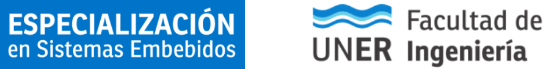

 

## Curso: Procesamiento Digital de Señales en Sistemas Embebidos

En este Repositorio se almacena ejemplos de código para ser utilizados durante el cursado de la asignatura Procesamiento Digital de Señales en Sistemas Embebidos.
Para cada unidad temática va a encontrar ejemplos de código en Python, utilizando Notebooks de Jupyter, y ejemplos de Firmware en C, que pueden ser utilizados con la placa ESP32 (utilizando ESP-IDF).

-----------

### Recursos

* [Campus Virtual](https://distancia.ingenieria.uner.edu.ar/course/view.php?id=49)

### Autores

* Juan Manuel Reta (juan.reta@uner.edu.ar)
* Juan Ignacio Cerrudo (juan.cerrudo@uner.edu.ar)
* Albano Peñalva (albano.penalva@uner.edu.ar)