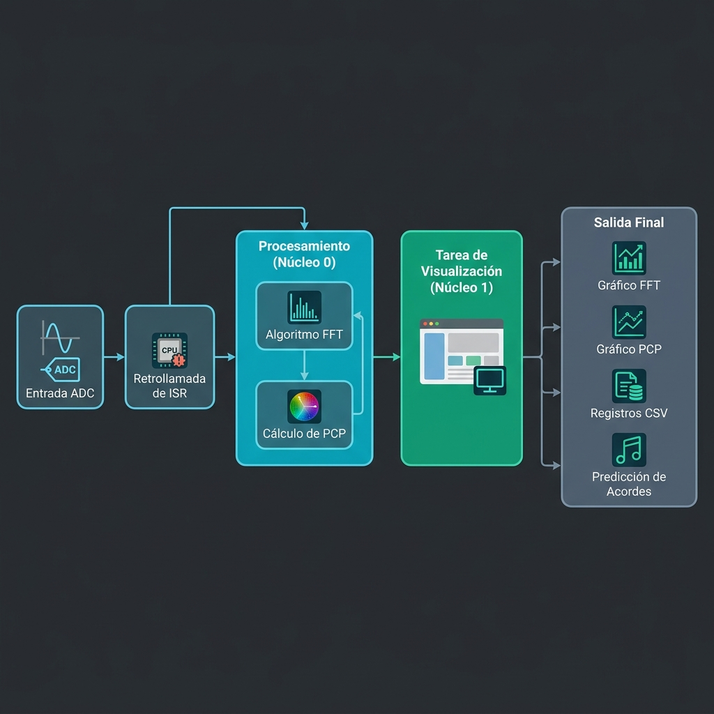

# Ejemplo Identificación mediante Correlación

Este ejemplo muestra como realizar adquisición de señales temporales, frecuenciales o de PCP; la visualización de las mismas y la identificación de acordes mediante correlación.

## Descripción del Funcionamiento

Este proyecto utiliza una arquitectura multi-tarea basada en **FreeRTOS** para realizar el procesamiento de señales en tiempo real.

### Tareas y Arquitectura
El firmware se divide en dos tareas principales distribuidas en los núcleos del ESP32:

*   **Tarea de Procesamiento (`tarea_procesamiento_fft`)**: 
    *   Ejecutada en el **Core 0** con prioridad alta (10).
    *   Se activa mediante notificaciones enviadas desde el **ISR del ADC** (`callback_adc_terminado`) cuando un buffer de muestras está listo.
    *   Aplica una ventana de **Hann**, calcula la FFT de punto flotante (usando la librería `esp-dsp`), obtiene la magnitud y calcula el **PCP (Pitch Class Profile)**.
*   **Tarea de Visualización (`tarea_visualizacion`)**:
    *   Ejecutada en el **Core 1** con prioridad menor (8).
    *   Recibe notificaciones de la tarea de procesamiento.
    *   Gestiona la salida por puerto serie (UART) para evitar bloqueos en la etapa de procesamiento.

### Modos de Operación
El comportamiento de la salida se configura mediante la variable `plot_config`, permitiendo los siguientes modos:

1.  **FFT**: Visualización gráfica del espectro de magnitud en frecuencia.
2.  **PCP**: Visualización del perfil cromático (energía acumulada en las 12 notas musicales).
3.  **LOGGING**: Envío de datos en formato CSV para análisis externo. Puede configurarse mediante `log_config` para enviar la señal temporal, los bins de la FFT o el vector PCP.
4.  **PREDICTION**: Identificación de acordes musicales mediante la correlación del PCP medido con patrones de referencia (`DO`, `RE`, `FA`, `SOL`).

### Diagrama de Flujo del Sistema



*(Si no puedes ver la imagen de arriba, asegúrate de refrescar la previsualización del Markdown).*


## Cómo usar el ejemplo

### Hardware requerido

1. Micrófono
2. Cables

### Configurar el proyecto

Seleccionar la frecuencia de muestreo, eligiendo uno de los valores previamente definidos: ``FS_1K``, ``FS_2K``, etc.
```
#define SAMPLE_FREQ     FS_8K                   
```
Seleccionar número de muestras a adquirir (debe ser múltiplo de 1024):
```
#define N_SAMPLES       1024                   
```
Seleccionar la unidad para la FFT (en dB mejora la visualización, en mV mejora el cálculo de la PCP):
```
unit fft_unit = MV; 
```
Seleccionar que se desea informar por terminal, ya sea gráficas o identificación:
```
display plot_config = PCP;
```
Seleccionar que información se desea loguear por terminal:
```
logconf log_config = LOG_TIME;
```
### Ejecutar la aplicación
Generar una señal de señal con excursión en el rango de tensiones soportados por el ADC (0 a 3.3V), y conectarla a la entrada del ADC (en este ejemplo está configurado el ADC1_6, que se corresponde con el GPIO34).

Luego de compilar y cargar el programa en la ESP32, para poder ver los resultados de la ejecución del programa es necesario abrir un monitor serie. Para los ejemplos de este curso utilizamos el puerto serie configurado a 921.600 baudios.
Si se desea utilizar un monitor integrado a la consola de VSCode, primero abra un nuevo ``ESP-IDF Terminal`` y luego ejecute la siguiente línea:

```
idf.py -p "COMX" -b 921600 monitor
```

Para cerrar el monitor ejecute en la terminal ``Ctrl-T`` y luego ``Ctrl-X``.

## Salida esperada
Ejemplo de la FFT en dB para un acorde de DO:

```
I (18907) view: Data min[113] = -2.495246, Data max[265] = 65.929138
 ________________________________________________________________________________________________________________________________
0                                                                                                                                |
1                                                                                                                                |
2                                                                                                                                |
3                                                                                                                                |
4                                                                                                                                |
5*       *       *                                                                                                               |
6*       *       *   *   *        *       *                                                                                      |
7*   *   *       *   *   *        *   *   *                *                                                                     |
8*   * * * * *   *   *   * *  * * *   *   *   *   *       **                                                                     |
9**  * * * * * *** * *   ****** *** * * * * * * * *   ** ***   *           *       *    *                     *               *  |
0*********** ******* *********************************************** * *** ***** *************** *********************** **  ****|
1********************************************************************************************************************************|
2******** *** ****************** ***************** ** ********************* ********************* * *************** ** ******* **|
3* **  ** ***   *****  ** * **     **  *  ** *     **  ***    *     ** * **   * ******** *  * * * * ****   ***  **   *  *****  **|
4       *         *          *         *            *   *           **          *  * **     * *      **         *                |
5       *                              *                                        *                     *                          |
6                                                                                                                                |
7                                                                                                                                |
8                                                                                                                                |
9                                                                                                                                |
 01234567890123456789012345678901234567890123456789012345678901234567890123456789012345678901234567890123456789012345678901234567
I (18947) view: Plot: Length=2048, min=-20.000000, max=100.000000
I (18947) Plot: Fs: 8000Hz
.
.
.
```
Ejemplo de la PCP en dB para un acorde de DO:

```
I (12417) view: Data min[6] = 0.185643, Data max[0] = 43.546040
 ________________________________________________________________________________________________________________________________
0                                                                                                                                |
1                                                                                                                                |
2                                                                                                                                |
3                                                                                                                                |
4                                                                                                                                |
5                                                                                                                                |
6                                                                                                                                |
7                                                                                                                                |
8                                                                                                                                |
9                                                                                                                                |
0_                                                                                                                               |
1                                                                                                                                |
2                                                                                                                                |
3                                                                          _                                                     |
4                                                                                                                                |
5                                                                                                                                |
6                                          _                                                                                     |
7                                                                                                                     _          |
8          _          _          _                    _          _                    _          _         _                     |
9                                                                                                                                |
 01234567890123456789012345678901234567890123456789012345678901234567890123456789012345678901234567890123456789012345678901234567
I (12457) view: Plot: Length=12, min=0.000000, max=100.000000
I (12467) Plot: Fs: 8000Hz
```
