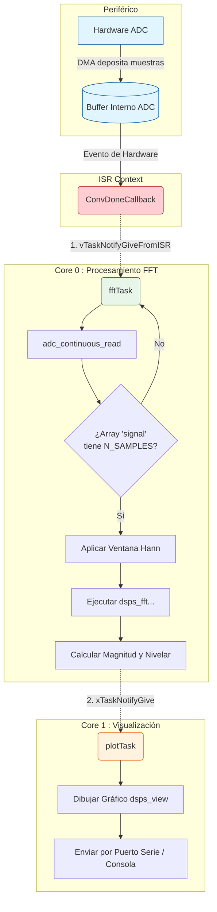
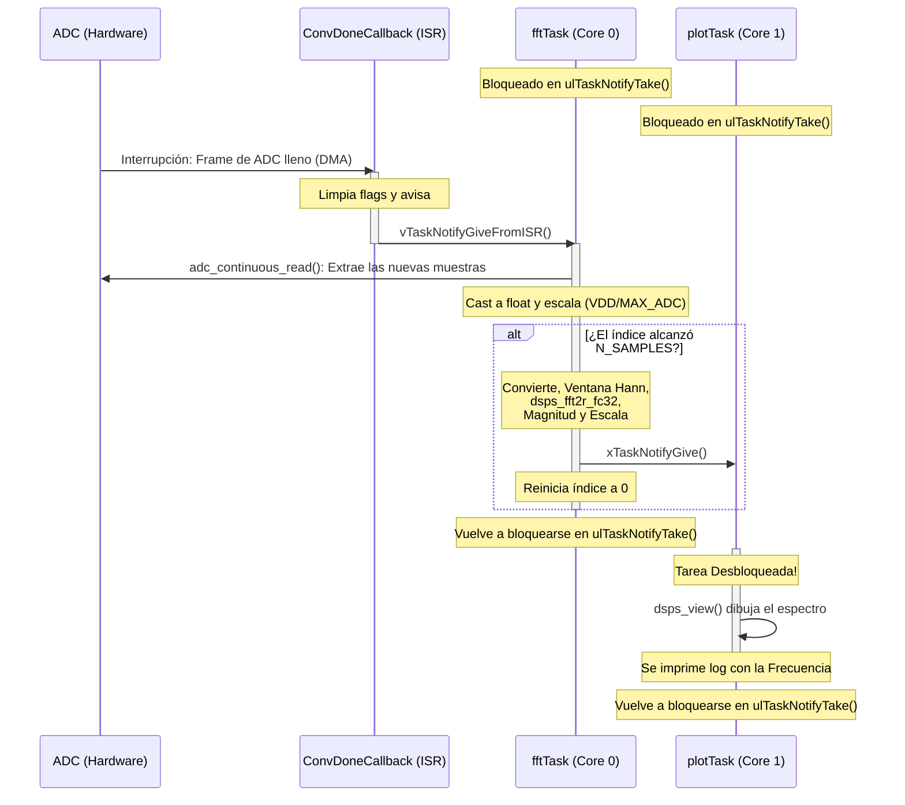

# Ejemplo FFT en tiempo real

Este ejemplo muestra como realizar adquisición en modo continuo utilizado el ADC del ESP32, para luego calcular la FFT de la señal adquirida, y visualizar la misma utilizando el terminal.

## Funcionamiento

* El ADC está configurado en modo continuo. Funciona en segundo plano de manera autónoma enviando muestras a la RAM. Cuando llega a cierto tamaño (BUFFER_SIZE), dispara ConvDoneCallback. Este callback solo despierta a la tarea `fftTask`, cediendo el CPU inmediatamente. En modo contínuo no es posible configurar el ADC para que adquiera a frecuencias menores a 20kHz, por lo que se utiliza un muestreo a 32kHz y se descartan muestras (en `fftTask`) para obtener la frecuencia de muestreo deseada.
* Core 0 acumula muestras y procesa: La tarea `fftTask` acumula bloques de datos (saltando muestras si la frecuencia de adquisicón deseada es menor a 32kHz) hasta alcanzar el total necesario para la FFT (N_SAMPLES). Solo cuando completa el buffer, realiza el consumo de CPU requierido para la FFT.
* Core 1 únicamente grafica: Cuando el Core 0 finaliza el cálculo, notifica a `plotTask` en el Core 1. Imprimir múltiples caracteres por la UART (dsps_view) puede ser lento; al mandarlo al núcleo secundario garantizamos que no se interrumpa ni ralentice la siguiente adquisición/procesamiento de audio del núcleo principal.

### Diagrama de flujo



### Diagrama de Secuencia



## Cómo usar el ejemplo

### Hardware requerido

1. ESP32
2. Módulo micrófono
2. Cables 

Conexiones:

| Micrófono | ESP32     | 
| :---:	    | :---:	    |
| +     	| VIN (5V)  | 
| G       	| GND 	    | 
| AO      	| GPIO34    | 

### Configurar el proyecto

Seleccionar la frecuencia de muestreo, eligiendo uno de los valores previamente definidos: ``FS_1K``, ``FS_2K``, etc.
```
#define SAMPLE_FREQ     FS_8K                   
```
Seleccionar número de muetras a graficar (debe ser múltiplo de 1024):
```
#define N_SAMPLES       1024                   
```

### Ejecutar la aplicación
Generar una señal de señal con excursión en el rango de tensiones soportados por el ADC (0 a 3.3V), y conectarla a la entrada del ADC (en este ejemplo está configurado el ADC1_6, que se corresponde con el GPIO34).

Luego de compilar y cargar el programa en la ESP32, para poder ver los resultados de la ejecución del programa es necesario abrir un monitor serie. Para los ejemplos de este curso utilizamos el puerto serie configurado a 921.600 baudios.
Si se desea utilizar un monitor integrado a la consola de VSCode, primero abra un nuevo ``ESP-IDF Terminal`` y luego ejecute la siguiente línea:

```
idf.py -p "COMX" -b 921600 monitor
```

Para cerrar el monitor ejecute en la terminal ``Ctrl-T`` y luego ``Ctrl-X``.

## Salida esperada
Silbando cerca del micrófono:

```
I (32696) view: Data min[124] = 1.524851, Data max[432] = 1895.813477
 ________________________________________________________________________________________________________________________________
0                                                                                                                                |
1                                                                                                                                |
2                                                                                                                                |
3                                                                                                                                |
4                                                                                                                                |
5                                                                                                                                |
6                                                                                                                                |
7                                                                                                                                |
8                                                                                                            *                   |
9*                                                                                                           *                   |
0*                                                                                                           *                   |
1*                                                                                                          **                   |
2*                                                                                                          **                   |
3*                                                                                                          **                   |
4*                                                                                                          **                   |
5*                                       *                                                                  **                   |
6*                                      **                                                                  **                   |
7*                                      **                                                                  **                   |
8 **************************************  ******************************************************************* *******************|
9                                                                                                                                |
 01234567890123456789012345678901234567890123456789012345678901234567890123456789012345678901234567890123456789012345678901234567
I (32736) view: Plot: Length=512, min=0.000000, max=3300.000000
I (32746) Plot: Fs: 4000Hz
.
.
.
```